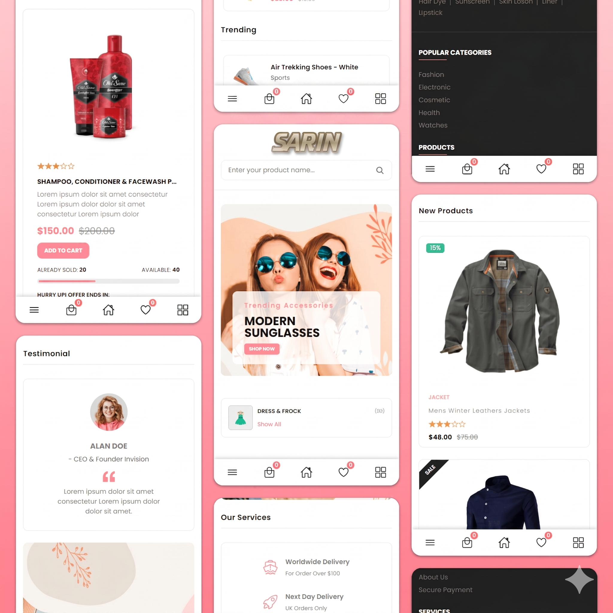

<div align="center">


  <br />
  <br />
  
  

  <h2 align="center">Dashboard - Admin Dashboard </h2>

  This dashboard is fully responsive for all devices, <br/> Built using HTML, CSS, and JavaScript.

  <a href="https://iamsayeduzzman.github.io/SARIN-e-Commerce/"><strong>➥ Live Demo</strong></a>

</div>

<br />

### Demo Screeshots




### Prerequisites

Before you begin, ensure you have met the following requirements:

* [Git](https://git-scm.com/downloads "Download Git") must be installed on your operating system.

### Run Locally

To run **Dashboard** locally, run this command on your git bash:

Linux and macOS:

```bash
sudo git clone https://github.com/iamSayeduzzman/dashboard-front-end-.git
```

Windows:

```bash
git clone https://github.com/iamSayeduzzman/dashboard-front-end-.git
```

### Contact

If you want to contact with me you can reach me at [Linkedin](https://www.linkedin.com/in/iamsayeduzzman/).

### License

This project is **free to use** and does not contains any license.
